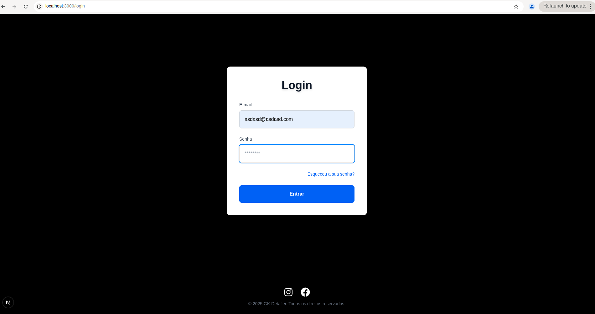
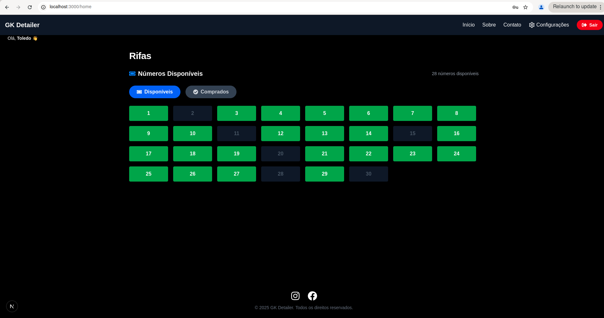
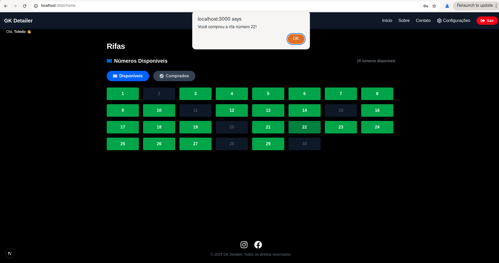
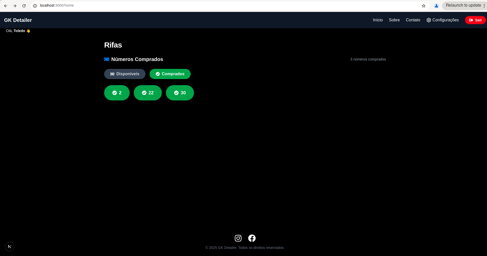
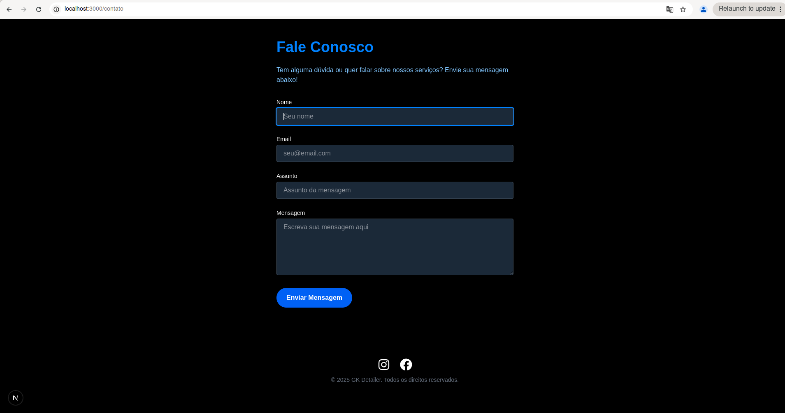
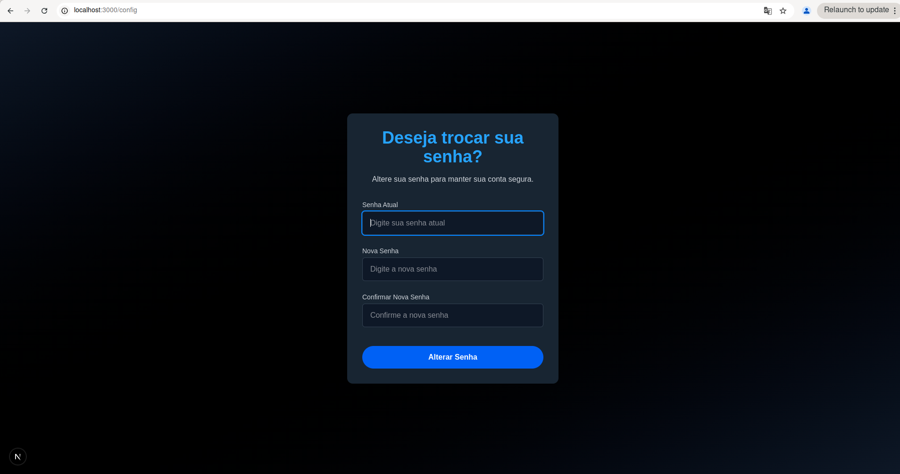
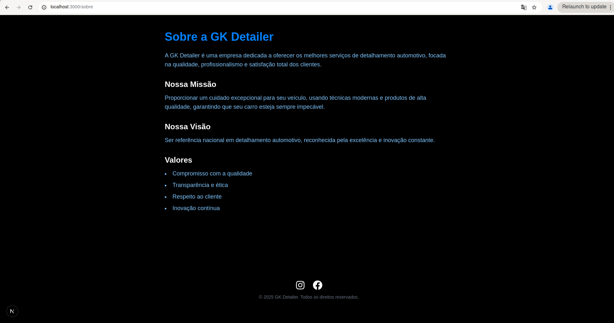

# 🎟️ Project-RFA | Plataforma de Rifas Online

**Project-RFA** é uma aplicação **web fullstack** desenvolvida com o objetivo de oferecer uma plataforma moderna, segura e intuitiva para **criação e participação em rifas online**.

Os usuários podem se cadastrar, fazer login, escolher números disponíveis e acompanhar os números comprados.

> 🔒 **Observação**: A **integração com pagamento não foi implementada**. A aplicação foca apenas no controle dos números comprados por usuário.  
> 🔐 O sistema utiliza **autenticação via token JWT**, garantindo segurança no acesso a rotas protegidas.

---

## 🚀 Tecnologias Utilizadas

- **Frontend**: Next.js com TypeScript  
- **Backend**: Express.js com TypeScript  
- **Banco de Dados**: MongoDB com Prisma ORM  
- **Linguagem Principal**: TypeScript  
- **Autenticação**: JSON Web Token (JWT)

---

## 📁 Estrutura do Projeto

project-rfa/
├── frontend/ # Projeto Next.js (interface do usuário)
└── backend/ # Projeto Express.js (API e lógica do servidor)


---

## 🛠️ Como Executar Localmente

### 1. Clone o repositório

```bash
git clone https://github.com/seu-usuario/Project-RFA.git
cd project-rfa

2. Instale as dependências
Frontend

cd frontend
npm install

Backend

cd ../backend
npm install

3. Configure os arquivos .env

Exemplo de .env no backend:

MONGO_URL=seu_link_mongodb
JWT_SECRET=sua_chave_secreta

💡 O frontend também pode precisar de variáveis públicas dependendo da sua configuração.
4. Rode o projeto
Backend

cd backend
npm run dev

Frontend (em outro terminal)

cd frontend
npm run dev

✅ Funcionalidades

    Cadastro de usuários com validação

    Login com autenticação via token JWT

    Escolha de números disponíveis

    Visualização dos números já comprados

    Redirecionamento conforme autenticação

❌ Funcionalidades Não Implementadas

    Integração com métodos de pagamento

    Dashboard administrativo completo

    Confirmação de e-mail para validar usuários

🖼️ Prints da Interface

**Tela de Login**  


# **Rifas disponíveis**  
# 

# **Comprando Rifa**  
# 

# **Números comprados**  
# 

# **Tela de contato**  
# 

# **Tela de configuração**  
# 

# **Tela Sobre**  
# 

📌 Estado do Projeto

O projeto está em desenvolvimento contínuo, com foco em:

    Melhorias na experiência do usuário

    Implementações futuras (pagamentos, painel admin)

    Adoção de boas práticas e escalabilidade

🤝 Contribuindo

Pull requests são bem-vindos!
Fique à vontade para sugerir melhorias, correções ou novas funcionalidades.


---